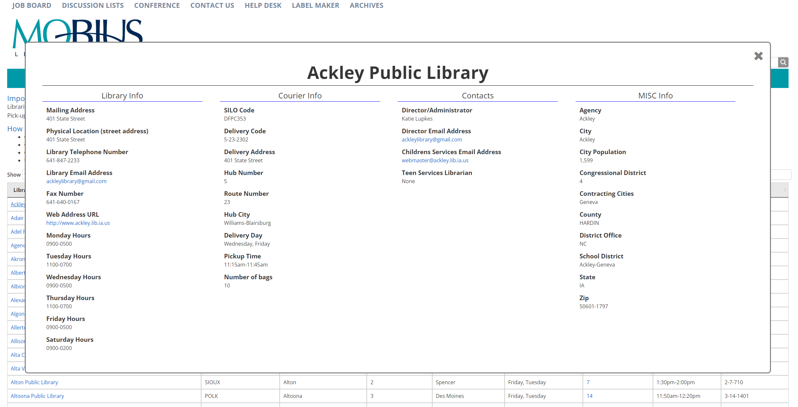

<h2 style="margin-top: 0px;" align="center">Mobius IOWA Courier Module</h2>
<h5 align="center">The
<a href="http://mobiusconsortium.org/iowacourier">Mobius IOWA Courier Module</a>
is intended for MOBIUS members and the Iowa partner libraries.</h5>

## Installation

This is a Drupal Module & requires Drupal version 9+

The iowacourier directory goes here...

    {{drupal-installation-directory}}/web/modules/custom/

example:

    /var/www/drupal/web/modules/custom/iowacourier

Once the iowacourier directory is copied to the modules/custom directory enable the module & click install.
You should be able to reach the url at:

    http://{your-site-here}/iowacourier
